# MessageAI - System Architecture

## 📐 Architecture Overview

MessageAI follows a **client-server architecture** with **Firebase as the backend** and **React Native as the mobile client**. The system is designed for real-time communication with offline-first capabilities.

---

## 🏗️ High-Level Architecture

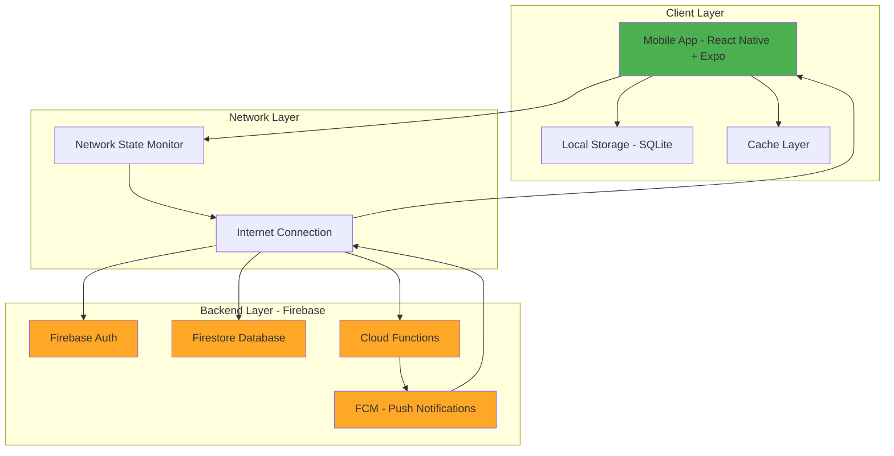

---

## 🔄 Data Flow Architecture

### Message Sending Flow

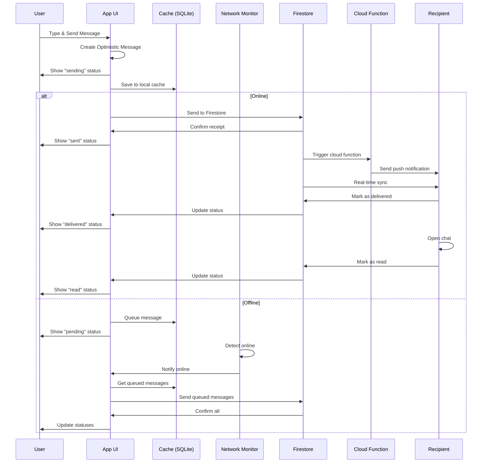

---

## 🗂️ Component Architecture

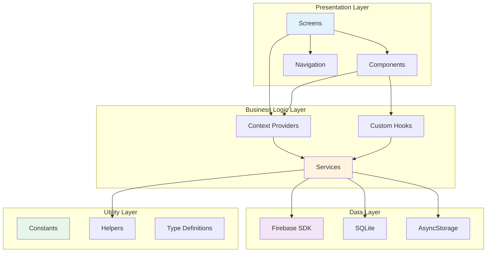

---

## 📊 Database Schema

### Firestore Collections

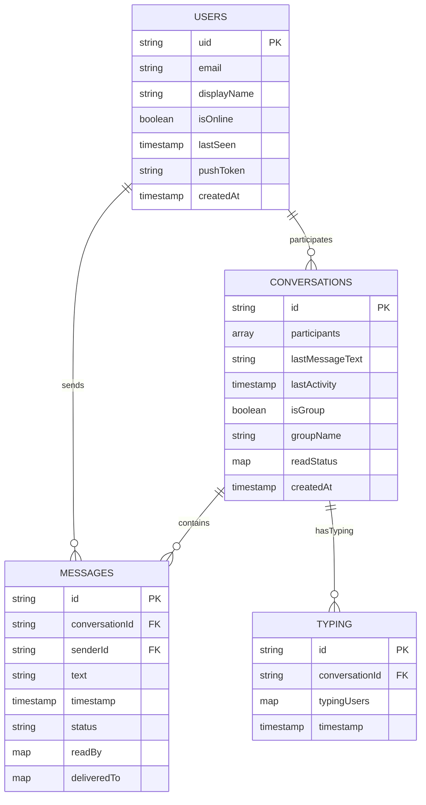

### SQLite Schema (Local Cache)

```sql
-- Messages Table
CREATE TABLE messages (
    id TEXT PRIMARY KEY,
    conversationId TEXT NOT NULL,
    senderId TEXT NOT NULL,
    text TEXT NOT NULL,
    timestamp INTEGER NOT NULL,
    status TEXT DEFAULT 'sent',
    synced INTEGER DEFAULT 1
);

-- Conversations Table
CREATE TABLE conversations (
    id TEXT PRIMARY KEY,
    participants TEXT NOT NULL,
    lastMessageText TEXT,
    lastActivity INTEGER,
    isGroup INTEGER DEFAULT 0,
    groupName TEXT,
    synced INTEGER DEFAULT 1
);

-- Indexes
CREATE INDEX idx_messages_conversation ON messages(conversationId, timestamp DESC);
CREATE INDEX idx_messages_synced ON messages(synced) WHERE synced = 0;
CREATE INDEX idx_conversations_activity ON conversations(lastActivity DESC);
```

---

## 🔐 Security Architecture

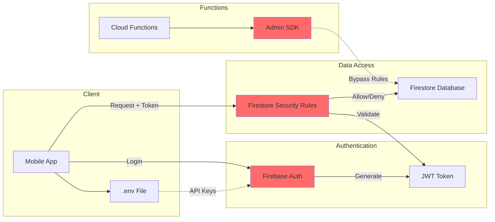

### Security Rules

```javascript
// Firestore Security Rules
rules_version = '2';
service cloud.firestore {
  match /databases/{database}/documents {
    // Only authenticated users can read/write
    match /users/{userId} {
      allow read: if request.auth != null;
      allow write: if request.auth.uid == userId;
    }
    
    match /messages/{messageId} {
      allow read: if request.auth != null;
      allow create: if request.auth != null && 
                      request.auth.uid == request.resource.data.senderId;
      allow update: if request.auth != null;
    }
    
    match /conversations/{conversationId} {
      allow read: if request.auth != null;
      allow write: if request.auth != null;
    }
  }
}
```

---

## 📡 Real-Time Sync Architecture

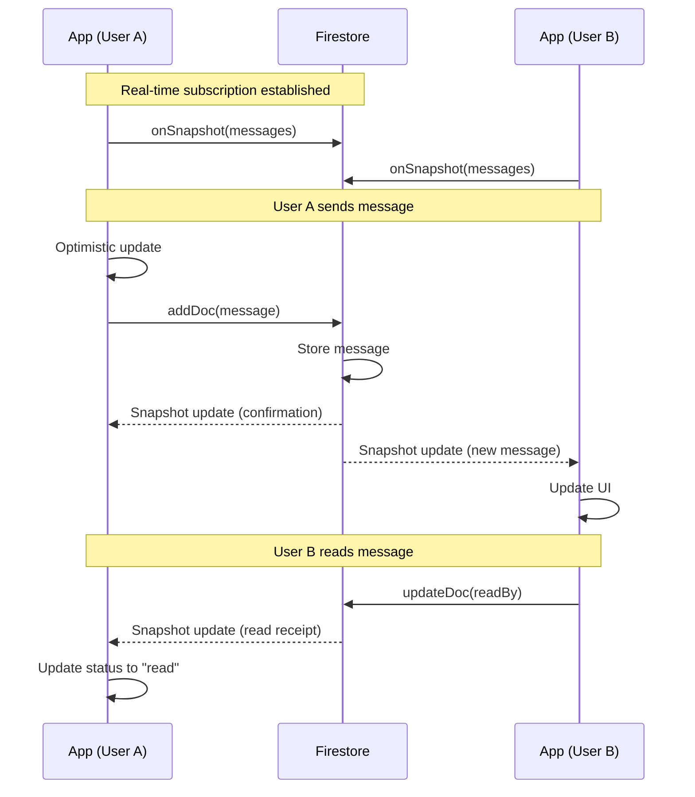

---

## 🔄 Offline-First Architecture

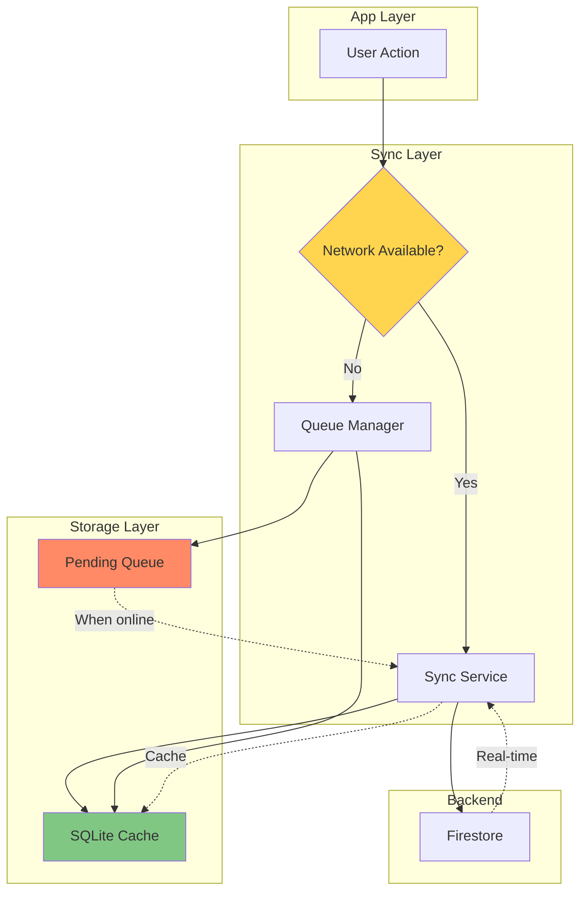

### Offline Strategy

1. **Write**: Save to SQLite immediately
2. **Read**: Load from SQLite first, then Firestore
3. **Sync**: Queue offline writes, sync when online
4. **Conflict Resolution**: Last-write-wins

---

## 📱 Mobile App Architecture

### Project Structure

```
MessageAI-App/
├── app/                          # Screens (Expo Router)
│   ├── (auth)/                  # Auth flow
│   │   ├── login.tsx
│   │   └── signup.tsx
│   ├── (tabs)/                  # Main navigation
│   │   ├── index.tsx            # Chat list
│   │   └── profile.tsx          # User profile
│   ├── chat/[id].tsx            # Chat screen
│   └── group/create.tsx         # Group creation
│
├── components/                   # Reusable components
│   ├── Avatar.tsx
│   ├── MessageBubble.tsx
│   ├── ConversationItem.tsx
│   ├── EmptyState.tsx
│   ├── ErrorMessage.tsx
│   └── LoadingSpinner.tsx
│
├── services/                     # Business logic
│   ├── auth.service.ts          # Authentication
│   ├── message.service.ts       # Messaging
│   ├── conversation.service.ts  # Conversations
│   ├── group.service.ts         # Group chat
│   ├── storage.service.ts       # SQLite operations
│   ├── sync.service.ts          # Offline sync
│   ├── presence.service.ts      # Online/typing status
│   └── notification.service.ts  # Push notifications
│
├── contexts/                     # React Context
│   └── AuthContext.tsx          # Auth state
│
├── utils/                        # Utilities
│   ├── constants.ts             # App constants
│   └── dateFormat.ts            # Date formatting
│
├── config/                       # Configuration
│   └── firebase.ts              # Firebase setup
│
└── types.ts                      # TypeScript types
```

---

## 🚀 Deployment Architecture

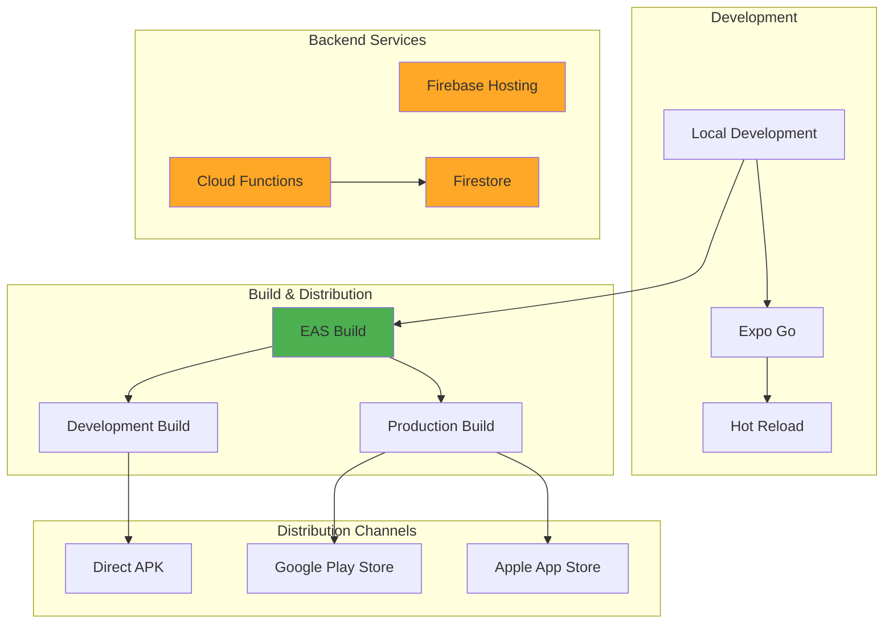

---

## 📊 Performance Optimization

### Caching Strategy

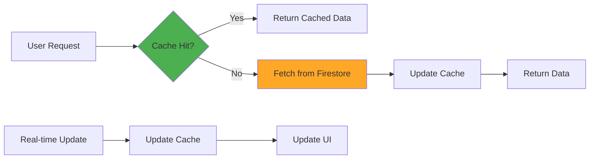

### Optimization Techniques

1. **Optimistic UI**: Instant user feedback
2. **Local-first**: SQLite cache for instant load
3. **Lazy Loading**: Load messages on demand
4. **Index Optimization**: Firestore composite indexes
5. **Connection Pooling**: Reuse Firebase connections
6. **Image Optimization**: (Future - compress uploads)

---

## 🔔 Notification Architecture

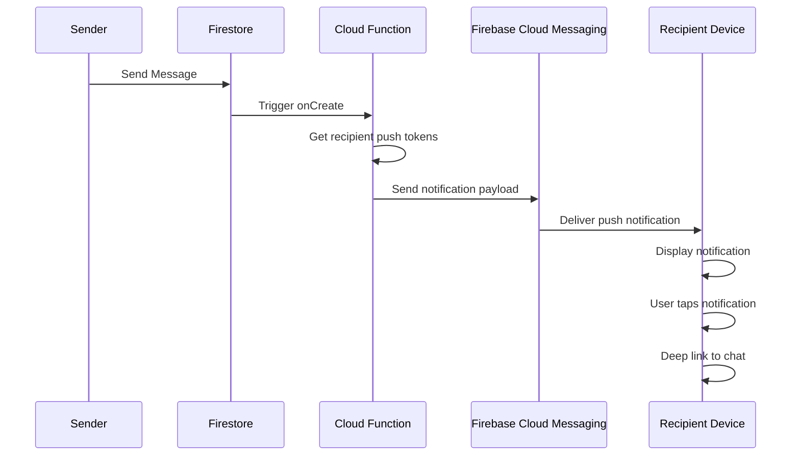

---

## 🧪 Testing Architecture

### Test Pyramid

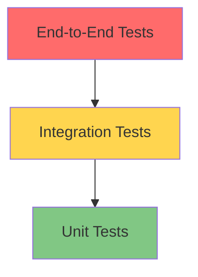

- **Unit Tests**: Service layer functions
- **Integration Tests**: Component interactions
- **E2E Tests**: User flow scenarios

---

## 📈 Scalability Considerations

### Current Capacity (MVP)
- **Users**: Suitable for 1K-10K daily active users
- **Messages**: Handles 100K+ messages/day
- **Storage**: Firestore unlimited
- **Functions**: 2M free invocations/month

### Scaling Strategy (Future)
1. **Database**: Firestore sharding by region
2. **Functions**: Increase memory/timeout limits
3. **CDN**: CloudFlare for static assets
4. **Caching**: Redis for frequently accessed data
5. **Load Balancing**: Geographic distribution

---

## 🔍 Monitoring & Observability

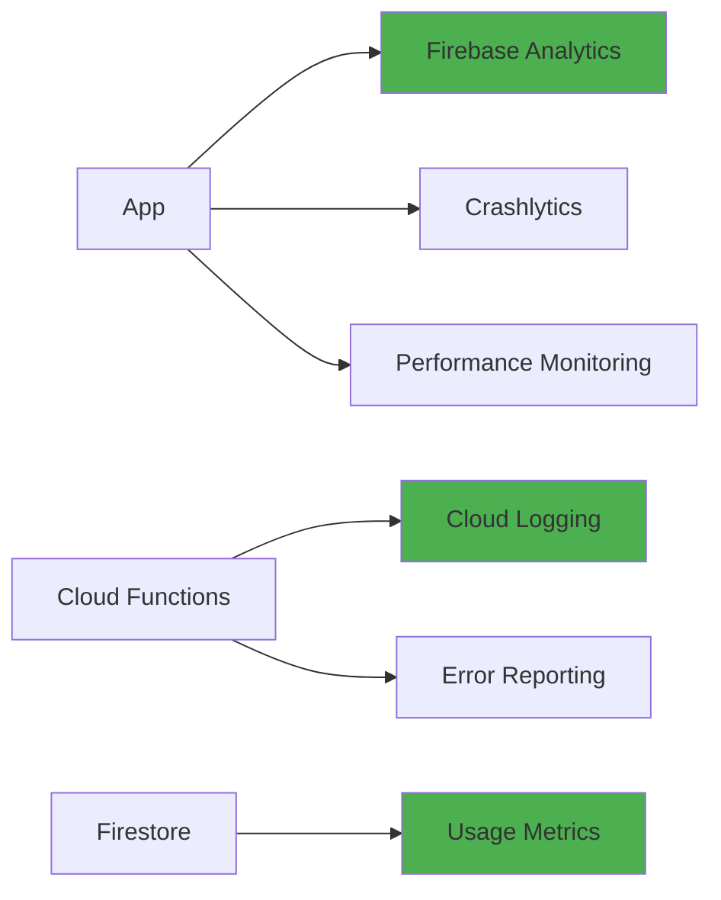

---

## 📝 Architecture Decision Records (ADRs)

### ADR-001: Firebase as Backend
**Decision**: Use Firebase (Firestore + Auth + Functions)  
**Rationale**: Real-time capabilities, managed infrastructure, quick MVP  
**Alternatives Considered**: Custom backend (Node.js + PostgreSQL + Socket.io)

### ADR-002: React Native with Expo
**Decision**: Use Expo for React Native development  
**Rationale**: Faster development, managed native modules, OTA updates  
**Alternatives Considered**: Plain React Native, Flutter

### ADR-003: SQLite for Local Storage
**Decision**: Use expo-sqlite for offline caching  
**Rationale**: Structured query support, reliable persistence  
**Alternatives Considered**: AsyncStorage (too limited), Realm (overkill)

### ADR-004: Optimistic UI Pattern
**Decision**: Implement optimistic updates for messages  
**Rationale**: Better UX, perceived performance  
**Trade-offs**: Complexity in error handling

---

**Last Updated**: October 21, 2025  
**Version**: 1.0.0  
**Status**: Production Ready

